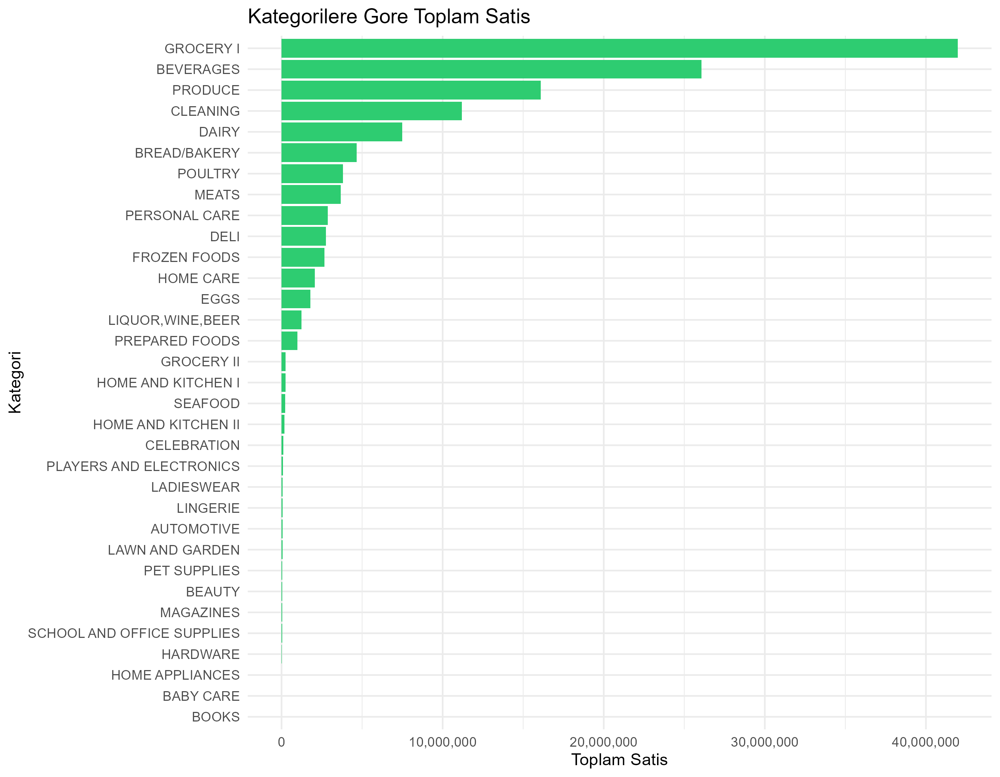
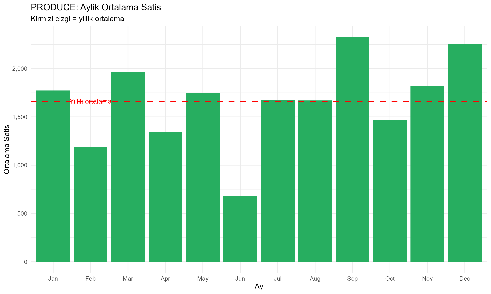
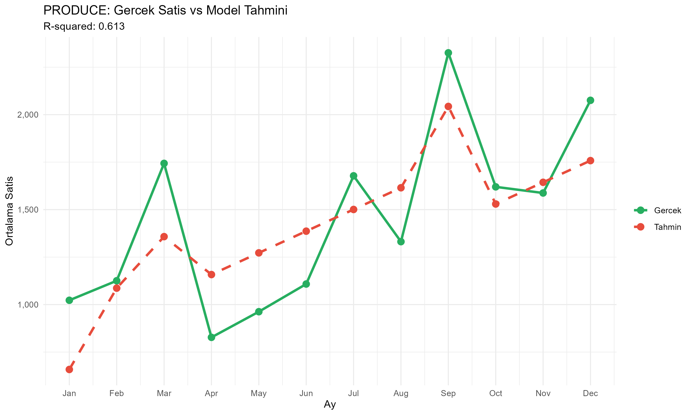

# 🛒 Market Sales & Agriculture Analysis

Ecuador'daki bir market zincirinin 4.5 yillik satis verisi 
uzerinde tarimsal talep analizi ve satis tahmini yapilmistir.

## 🎯 Proje Amaci

Tarimsal urunlerin (sebze, meyve, et, sut) mevsimsel 
satis davranisini analiz ederek:
- Hangi ayda talep artiyor?
- Uretim ve stok planlama icin ne zaman hazirlik yapilmali?
- Gelecek ay satisi tahmin edilebilir mi?

## 🌾 Tarimsal Baglanti

Normal analist: "Aralik'ta satis ardi."

Bu projede: "PRODUCE satislari Eylul ve Aralik'ta 
zirve yapiyor. Ciftciler Agustos-Ekim donemi icin 
uretim planlamali, tedarik zinciri %15 fazla stok 
olmali."

## 📊 Analizler

- **EDA** — 322.047 satir veri kesfedildi
- **Mevsimsellik** — PRODUCE Haziran'da %40 dusuyor
- **Tarimsal karsilastirma** — 5 kategori analiz edildi
- **Satis tahmini** — Linear Regression (R²: 0.613)

## 📈 Ornek Gorseller

### Kategorilere Gore Toplam Satis

### PRODUCE Mevsimsellik

### Gercek vs Tahmin

## 🛠️ Kullanilan Araclar

- R 4.5 + RStudio
- tidyverse (veri manipulasyonu)
- ggplot2 (gorsellestirme)
- lubridate (tarih isleme)
- scales (formatlama)
- Linear Regression (lm)

## 📁 Proje Yapisi
market-sales-agriculture/
├── data/        # Ham veri (Kaggle'dan indirilir)
├── scripts/     # R analiz kodlari
│   ├── 01_data_exploration.R
│   ├── 02_EDA.R
│   ├── 03_agricultural_insights.R
│   └── 04_sales_forecast.R
├── output/      # Grafikler
└── README.md

## 🔗 Veri Kaynagi

[Store Sales - Time Series Forecasting (Kaggle)](https://www.kaggle.com/competitions/store-sales-time-series-forecasting)
